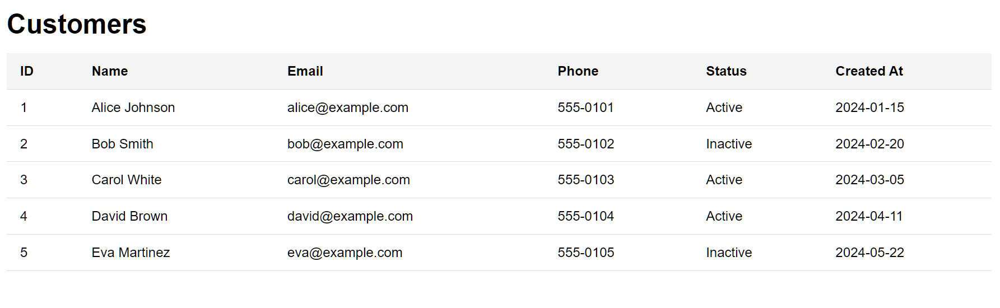

# E2E-testcreator

AI assisted test automation. Creating E2E test cases for React app with AI from human written specifications. Robot framework is used for test cases. The actual test cases are defined in robot framework code and they do not change between test automation runs.

The CI/CD pipeline can be Jenkins or any other tool.

The React frontend looks like this. The test cases make assertions based on the specifications using data seen on the GUI.



## React App

```bash
npm start   # dev server at http://localhost:3000
npm test    # run tests
```

## E2E Tests

```bash
pip install -r e2e-tests/requirements.txt  # one-time setup
npm start                                   # run app in separate terminal
python -m robot e2e-tests/customers_table.robot
```

## Handling Specification Changes

When a feature branch changes the specification, the E2E tests need to be updated
to match. The recommended workflow uses AI to automate this:

1. **Create a feature branch** with your specification change (see branch `featurex` as an
   example — it adds a `Country` column to `specifications/items-table.md`).

2. **Generate the diff** from `main` to see what the feature branch changed:
   ```bash
   git diff main..featurex -- specifications/
   ```

3. **Use the prompt** in `prompts/update-tests-from-diff.md` — paste the diff into
   the prompt template and send it to Claude Code (or any AI assistant). It will
   update `e2e-tests/customers_table.robot` to cover the new columns, remove
   obsolete assertions, and fix CSS `nth-child` indices automatically.

This keeps tests in sync with specifications without manual test editing.
